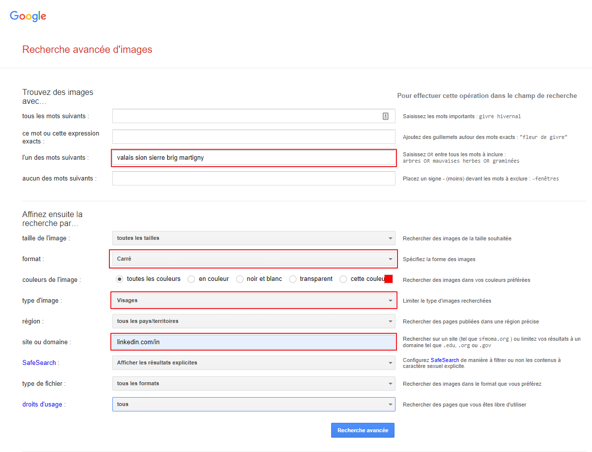

# FaceRecognition 

## se connecter au docker dev
docker exec -it facerecognition-dev-1 /bin/bash

# VIEUX
# NE PAS S'Y RÉFÉRER

## Comment est construite la base de données ?
### Table "scraping"
Mise en db de toutes les images scrapes, avant même le processing
| Key | Description |
| ----------- | ----------- |
| id | Id unique |
| alt | Valeur scraper depuis la source, le nom |
| hash | le hash de l'image sauvegardé |
| origine | origine du scrape |

### Table "global"
Les images après process et encoder
| Key | Description |
| ----------- | ----------- |
| id | Id unique |
| name | Nom de la personne |
| data | Quelques autres infos obtenu avec le scraping |
| hash | Hash de l'image |
| vector | La représentation vectoriel du visage encodé en base64 |
| group_id | Groupe auquelle appartient le visage (k-neighbors par exemple) |
| source | Source de l'image, avec quel scrape elle est venu |

### Table "celebrities" (Avant 29.01.22)
contients les infos et visages des célébrités
| Key | Description |
| ----------- | ----------- |
| id | Id unique |
| img_url | url du visage scrapé |
| name | Nom de la celebrité |
| type | Homme/femme (Actor/Actress) |
| film | Film où la personne à joué |
| desc | Courte description de la personne |
| hash | Hash de l'image |
| vector | La représentation vectoriel du visage encodé en base64 |
| group_id | Groupe auquelle appartient le visage (k-means par exemple) |

### Table "celebrities_data" (Après 29.01.22)
| Key | Description |
| ----------- | ----------- |
| id | Id unique |
| name | Nom de la celebrité |
| type | Homme/femme (Actor/Actress) |
| film | Film où la personne à joué |
| desc | Courte description de la personne |

Je voulais pouvoir mettre plusieurs photos de la meme personne, donc j'ai splité "celebrities" en 2 tables distinctes : "celebrities_data" et "celebities_faces".
Afin de faire de transfere de donnée, j'ai créé la nouvelle table. Puis j'ai executé ce sql afin de copier les données 
```sql
INSERT INTO celebrities_faces (celebrity_id, celebrity_name, img_url, hash, vector, group_id)
SELECT id, name, img_url, hash, vector, group_id
FROM celebrities_data
WHERE vector NOT NULL;
```
ensuite il m'a juste fallu supprimer les colones en trop pour avoir la nouvelle table.
Pour tester et mettre à jour le code, j'ai supprimé les données avec
```sql
DELETE FROM celebrities_data;
DELETE FROM celebrities_faces;
DELETE FROM sqlite_sequence WHERE name="celebrities_data" OR name="celebrities_faces"
```
puis j'ai pu modifier les scripts afin que tous soit bon.

### Table "celebrities_faces" (Après 29.01.22)
| Key | Description |
| ----------- | ----------- |
| id | id qui autoincrement |
| celebrity_id | Id de la celebritée de "celebrities_data" |
| celebrity_name | nom de la celebritée de "celebrities_data" |
| img_url | url du visage scrapé |
| hash | Hash de l'image |
| vector | La représentation vectoriel du visage encodé en base64 |
| group_id | Groupe auquelle appartient le visage (k-means par exemple) |
| origin | origine de la photo |

afin d'ajouter un id a une table déjà existant, j'utilise
```sql
CREATE TABLE "celebrities_faces_id" (
	"id" INTEGER PRIMARY KEY AUTOINCREMENT,
	"celebrity_id"	INTEGER,
	"celebrity_name"	TEXT,
	"img_url"	TEXT,
	"hash"	TEXT,
	"vector"	TEXT,
	"group_id"	INTEGER
);
INSERT INTO celebrities_faces_id(celebrity_id, celebrity_name, img_url, hash, vector,group_id)
SELECT celebrity_id, celebrity_name, img_url, hash, vector,group_id
FROM celebrities_faces;

DROP TABLE celebrities_faces;
ALTER TABLE celebrities_faces_id RENAME TO celebrities_faces;
```

## Comment les données sont récupéré ? 
### 1. Les personnes lambda depuis linkdin
Grâce a [cet outil de google image](https://www.google.com/advanced_image_search) et quelques paramètres (voir ci-dessous), on peut obtenir toutes les photos de profiles des utilisateurs avec leur nom et profession

J'utilise un navigateur spécial [` Sélénium `](https://www.selenium.dev/documentation/webdriver/) afin de pouvoir controler les actions du navigateur.
J'injecte un script javascript [`scraper.js`](scraper.js) puis je recupere le contenu.

### 2. Les célébrités
Juste un petit scrape de [imdb](https://www.imdb.com/search/name)

### 3. IMDb-face
[IMDb-face](https://github.com/fwang91/IMDb-Face) est un jeu de donnée créer par Fei Wang, Liren Chen, Cheng Li, Shiyao Huang, Yanjie Chen, Chen Qian et Chen Change Loy.
"IMDb-Face is a new large-scale noise-controlled dataset for face recognition research. The dataset contains about 1.7 million faces, 59k identities, which is manually cleaned from 2.0 million raw images." (via [github](https://github.com/fwang91/IMDb-Face))

```
@article{wang2018devil,
	title={The Devil of Face Recognition is in the Noise},
	author={Wang, Fei and Chen, Liren and Li, Cheng and Huang, Shiyao and Chen, Yanjie and Qian, Chen and Loy, Chen Change},
	journal={arXiv preprint arXiv:1807.11649},
	year={2018}
}
```

#### a) Problemes rencontrés
Le fichier est très grand et afin de pouvoir telecharger un maximum de donnée en un minimum de temps , il a fallu gerer les threads.
Beaucoup de photo renvoye un 404 lors de la requete => perte de temps

Apres le telechargement, je me suis retrouvé avec un disque dur rempli de photo et un fichier `data_hash.csv` contenant le nom, l'url et l'hash. Or certaine photo n'ont pas été telechargé du au 404 où d'autres problemes difficile à identifier. Donc il faut trier les rows à ajouter à la base de donnée

## Les fichiers importants
Cheminement pour obtenir toutes les données

### 1. [`scraper.py`](scraper.py)
Point de départ du scraping de visages/données
Il va :
1. Ouvrir une fennetre sélénium
2. Injecter [`scraper.js`](scraper.js)
3. Telecharger les photos
4. Tout sauvegarder dans la base de données (table scraping)
5. Selectionner les photos dupliquées et les supprimers
    Certain alt ont plusieurs visages reliées, comme on ne sait pas lesquelles sont les vrais visages, on supprime dès que un doute

usage :
```
usage: scraper.py [-h] [-k KEYWORD] [-o OUTPUT] [-d DEBUG]    

optional arguments:
  -h, --help            show this help message and exit
  -k KEYWORD, --keyword KEYWORD
                        mots que le robot va chercher dans google. separer par virgule ex: sion,sierre,brig. default: martigny,sion,sierre,brig
  -o OUTPUT, --output OUTPUT
                        image output folder. default: images/before_process
```

### 2. [`extractor.py`](extractor.py)
Extrait le visage des photos

Comment ?
1. Localisé le visages avec soit opencv `haarcascade_frontalface_default.xml`, soit avec `MTCNN`
   Opencv utilise la caractéristiques pseudo-Haar qui est rapide mais moins précis
   MTCNN utilise un réseau de neurone afin de localiser les visages, plus précis, moins rapide
2. Recadrer sur le visage
3. Sauvegarder le visage

usage : 
```
usage: extractor.py [-h] [-i INPUT] [-o OUTPUT] [-t TARGET_SIZE] [-d]   

optional arguments:
  -h, --help            show this help message and exit
  -i INPUT, --input INPUT
                        Input folder. default=images/before_process     
  -o OUTPUT, --output OUTPUT
                        image output folder. default=images/face_extract
  -t TARGET_SIZE, --target-size TARGET_SIZE
                        output target size. default=150,150
  -d, --dpl             Use deeplearning face detection (MTCNN)
```

### 3. [`encoding.py`](encoding.py)
Encode les visages en vecteur et les ajoutes dans la base de donnée

usage : 
```
usage: encoding.py [-h] [-i INPUT] [-s SOURCE] [-t TABLE] [-u]    

optional arguments:
  -h, --help            show this help message and exit
  -i INPUT, --input INPUT
                        Input folder. default=images/faces_extract
  -s SOURCE, --source SOURCE
                        Source of data
  -t TABLE, --table TABLE
                        table dans laquelle mettre les infos      
  -u, --update          Update la table au lieu de add
```

### 4. [`api.py`](api.py)
Contient l'api pour encoder et reconnaitre les personnes

Routes : 
- /whois (POST)
body : file
return: json name

- /encode (POST)
body : file
return: json 128vector

## Problemes rencontrées

### a) Les bases de données
Sqlite devenait trop petit, donc migration vers mongodb avec docker